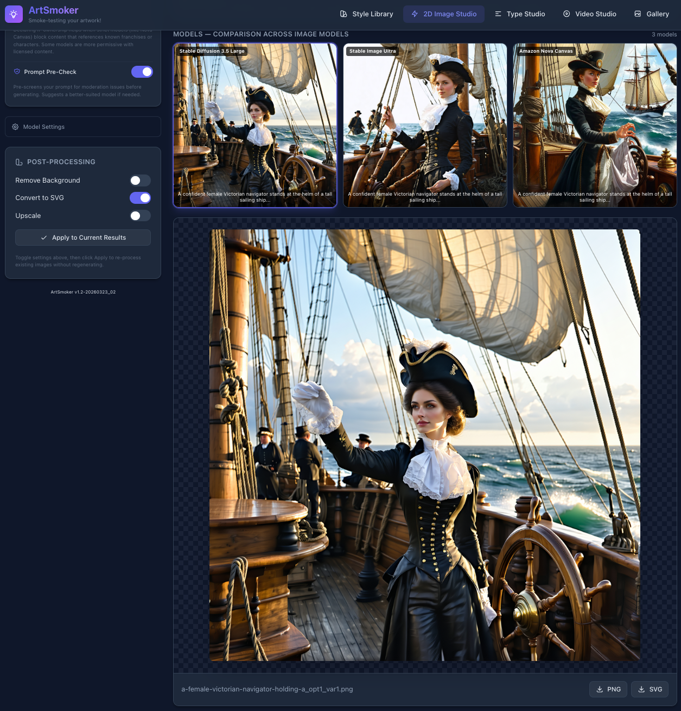

> यह दस्तावेज़ अंग्रेज़ी README का अनुवाद है। नवीनतम जानकारी के लिए [English README](README.md) देखें।

# ArtSmoker
> *अपनी कलाकृतियों का स्मोक-टेस्ट करें!*


## 📌 0. सारांश

Amazon Bedrock के इमेज और वीडियो जनरेशन मॉडल्स के लिए एक सरल, कलाकार-अनुकूल इंटरफ़ेस। ArtSmoker क्रिएटिव टीमों को बिना API, CLI या प्रॉम्प्ट इंजीनियरिंग सीखे Bedrock का कुशलतापूर्वक उपयोग करने में मदद करता है।

### 📝 समस्या

क्रिएटिव टीमें और गेम स्टूडियो AI का उपयोग एसेट जनरेशन के लिए करना चाहते हैं, लेकिन वास्तविक बाधाओं का सामना करते हैं:

- **कोई सरल इंटरफ़ेस नहीं** — कलाकारों को इमेज जनरेट करने के लिए Bedrock कंसोल में लॉगिन या API कॉल्स लिखने की ज़रूरत नहीं होनी चाहिए
- **प्रॉम्प्ट इंजीनियरिंग कठिन है** — उचित नेगेटिव प्रॉम्प्ट्स, स्टाइल निर्देश और मॉडल-विशिष्ट फ़ॉर्मेटिंग के साथ प्रभावी प्रॉम्प्ट तैयार करना विशेषज्ञता माँगता है जो अधिकांश कलाकारों के पास नहीं होती
- **टीमें अपने मॉडल नहीं बनातीं/प्रशिक्षित नहीं करतीं** — उन्हें Bedrock पर पहले से उपलब्ध कई मॉडल्स तक पहुँच चाहिए, किसी ऐसे माध्यम से जिसे वे वास्तव में उपयोग कर सकें
- **इमेज एडिटिंग दुर्गम है** — इनपेंटिंग, आउटपेंटिंग, सर्च एंड रिप्लेस, और स्टाइल ट्रांसफ़र सभी के लिए API ज्ञान आवश्यक है

### 📝 समाधान

ArtSmoker एक सेल्फ-होस्टेड वेब एप्लिकेशन है जो Amazon Bedrock को एक साफ़-सुथरे क्रिएटिव इंटरफ़ेस में लपेटता है। गेम एसेट प्रोडक्शन के लिए विशेष रूप से बनाया गया है, और विज्ञापन, ई-कॉमर्स, प्रकाशन, और डिजिटल मीडिया जैसी अन्य क्रिएटिव इंडस्ट्रीज़ पर भी लागू होता है जहाँ AI-जनित विज़ुअल कंटेंट मूल्यवान है।

- **कलाकार बस वर्णन करते हैं कि उन्हें क्या चाहिए** सामान्य भाषा में — ArtSmoker पर्दे के पीछे प्रॉम्प्ट कम्पोज़िशन, नेगेटिव प्रॉम्प्ट एक्सट्रैक्शन, मॉडल-विशिष्ट फ़ॉर्मेटिंग और स्टाइल एप्लिकेशन संभालता है
- **स्टाइल-अवेयर जनरेशन** — अपने गेम की मौजूदा कला अपलोड करें, और ArtSmoker के विज़न मॉडल्स आपकी विज़ुअल पहचान सीखें। हर जनरेट किया गया एसेट आपके गेम की लुक एंड फ़ील से मेल खाता है
- **सभी Bedrock मॉडल्स, सभी रीजन्स** — पूरी तरह कॉन्फ़िगर करने योग्य। अपने टेक्स्ट-टू-इमेज मॉडल्स, वीडियो मॉडल्स और रीजन्स चुनें। सिस्टम Bedrock API के माध्यम से उपलब्ध मॉडल्स को गतिशील रूप से खोजता है
- **सेल्फ-डिप्लॉयड, सेल्फ-बिल्ड** — अपने स्वयं के इंफ़्रास्ट्रक्चर पर चलता है, अपने AWS अकाउंट का उपयोग करता है। कोई साझा एंडपॉइंट नहीं, कोई थर्ड-पार्टी डेटा एक्सेस नहीं, कोई अप्रत्याशित बिल नहीं

Amazon Bedrock पर निर्मित: Claude Sonnet/Opus (प्रॉम्प्ट इंजीनियरिंग और चैट), Nova Canvas, Titan Image, Stable Diffusion 3.5 Large, Stable Image Ultra, Stability AI (इमेज एडिटिंग), Nova Reel, Luma AI Ray (वीडियो जनरेशन), साथ ही Chat Studio के लिए 16 प्रदाताओं से 80+ LLM।

**[अभी शुरू करें — आवश्यकताएँ और इंस्टॉलेशन पर जाएँ ▸](#get-started)**

### Language / 言語 / 语言 / 언어 / हिन्दी / Язык / Langue / Idioma

ArtSmoker 8 भाषाओं का समर्थन करता है। शीर्ष नेविगेशन बार में भाषा बटनों (EN | 日 | 中 | 한 | हिं | РУ | FR | ES) से UI भाषा बदलें। आपका चयन स्वचालित रूप से सहेजा जाता है।

| भाषा | README |
|------|--------|
| English | [README.md](README.md) |
| 日本語 (Japanese) | [README.ja.md](README.ja.md) |
| 中文 (Chinese) | [README.zh.md](README.zh.md) |
| 한국어 (Korean) | [README.ko.md](README.ko.md) |
| हिन्दी | यह दस्तावेज़ |
| Русский (Russian) | [README.ru.md](README.ru.md) |
| Français (French) | [README.fr.md](README.fr.md) |
| Español (Spanish) | [README.es.md](README.es.md) |

**बहुभाषी प्रॉम्प्ट समर्थन:**
- गैर-अंग्रेज़ी प्रॉम्प्ट्स (हिन्दी, जापानी, चीनी, कोरियाई, रूसी, फ़्रेंच, स्पेनिश आदि) स्वचालित रूप से पहचाने जाते हैं और जनरेशन से पहले अंग्रेज़ी में अनुवादित होते हैं
- प्रॉम्प्ट क्षेत्र में द्विभाषी पूर्वावलोकन दिखता है: अपने मूल टेक्स्ट और अंग्रेज़ी अनुवाद के बीच टॉगल करें ताकि यह देख सकें कि मॉडल को वास्तव में क्या प्राप्त होगा
- मूल प्रॉम्प्ट, पहचानी गई भाषा और अंग्रेज़ी अनुवाद सभी एसेट मेटाडेटा में संरक्षित होते हैं
- फ़ाइल नाम अनुवादित अंग्रेज़ी प्रॉम्प्ट से जनरेट होते हैं (जैसे "अस्पताल की इमारत" → `hospital-building_opt1_var1.png`)
- Chat Studio प्रॉम्प्ट्स को सीधे LLM को भेजता है (बिना अनुवाद) — क्योंकि Claude जैसे मॉडल स्वाभाविक रूप से बहुभाषी हैं
- Type Studio का टेक्स्ट आपकी भाषा में ही रहता है (इमेज पर जैसा है वैसा ही रेंडर होता है)
- सभी मॉडरेशन प्री-चेक और कंटेंट स्क्रीनिंग एकरूपता के लिए अनुवादित अंग्रेज़ी प्रॉम्प्ट पर काम करते हैं

## 📌 1. यह क्या करता है

ArtSmoker दो मोड में काम करता है — **स्टैंडअलोन** (कोई आर्ट स्टाइल या थीम सेटअप ज़रूरी नहीं, बस वर्णन करें और जनरेट करें) और **स्टाइल-गाइडेड** (अपनी मौजूदा कला अपलोड करें, और हर जनरेशन आपकी विज़ुअल पहचान से मेल खाए)। दोनों मोड समान स्टूडियो और जनरेशन पाइपलाइन का उपयोग करते हैं।

### 📝 स्टैंडअलोन मोड (क्विक स्टार्ट)

कोई स्टाइल या थीम सेटअप ज़रूरी नहीं — 2D Image Studio, Video Studio, या Type Studio खोलें और तुरंत बनाना शुरू करें।

1. **वर्णन करें कि आपको क्या चाहिए** — "hospital building" या "fire mage character" जैसा प्रॉम्प्ट टाइप करें, या वॉइस इनपुट का उपयोग करें। AI स्वचालित रूप से उचित कम्पोज़िशन निर्देश, नेगेटिव प्रॉम्प्ट्स और मॉडल-विशिष्ट फ़ॉर्मेटिंग के साथ आपके प्रॉम्प्ट को बेहतर बनाता है।
2. **अपने मॉडल्स और सेटिंग्स चुनें** — सभी उपलब्ध टेक्स्ट-टू-इमेज मॉडल्स (Bedrock + सेल्फ-होस्टेड) से मल्टी-सेलेक्ट करें, डाइमेंशन, क्वालिटी टियर और रीजन चुनें। साइड-बाय-साइड तुलना के लिए कई मॉडल्स चेक करें, या केंद्रित जनरेशन के लिए एक चुनें। लागत अनुमान लाइव अपडेट होता है।
3. **कई विकल्प प्राप्त करें** — सिस्टम 5 तक भिन्न क्रिएटिव कॉन्सेप्ट्स जनरेट करता है, प्रत्येक में 5 तक सीड वेरिएशन (कुल 25 इमेज)। अपनी पसंद का चुनें।
4. **एडिट और रिफ़ाइन करें** — Asset Viewer में सीधे इनपेंटिंग, आउटपेंटिंग, इरेज़, सर्च एंड रिप्लेस, या रीकलर का उपयोग करें। प्रत्येक एडिट एक नया वर्शन बनाता है — मूल हमेशा सुरक्षित रहता है।
5. **गेम-रेडी फ़ाइलें डाउनलोड करें** — पारदर्शी पृष्ठभूमि वाली PNG + SVG, वर्णनात्मक नामों के साथ (जैसे `hospital-building_opt2_var3.png`)। वीडियो MP4 के रूप में एक्सपोर्ट होते हैं।

### 📝 स्टाइल-गाइडेड मोड (अपनी आर्ट स्टाइल और थीम से मिलाएँ)

उन टीमों के लिए जो चाहती हैं कि हर जनरेट किया गया एसेट मौजूदा आर्ट स्टाइल से मेल खाए — रेफ़रेंस इमेज अपलोड करें और AI को अपनी विज़ुअल पहचान सीखने दें।

1. **अपने गेम की कला अपलोड करें** — लोकल डायरेक्टरीज़ (रिकर्सिव स्कैन, डुप्लीकेशन से बचने के लिए सिमलिंक) या S3 बकेट्स (पैजिनेशन के साथ रिकर्सिव लिस्टिंग) से रेफ़रेंस इमेज इम्पोर्ट करें। **स्मार्ट डीडुप्लीकेशन** स्वचालित रूप से चलता है — रोटेशन वेरिएंट्स (barrel_N/E/S/W.png से केवल barrel_S.png रखता है) और एनिमेशन फ़्रेम (Idle0-Idle8 से केवल Idle रखता है) हटाता है। उदाहरण के लिए, 747-फ़ाइल आइसोमेट्रिक एसेट पैक लगभग 99 अद्वितीय ऑब्जेक्ट्स में डीडुप्लीकेट होता है। समर्थित: .png, .jpg, .jpeg, .gif, .bmp, .webp, .tiff, .tif, .tga, .ico, .svg, साथ ही 3D मॉडल्स (.glb, .gltf) से स्वचालित टेक्सचर एक्सट्रैक्शन।
2. **AI आपकी स्टाइल सीखता है** — दो-चरणीय कोहेज़न-अवेयर विश्लेषण: पहले, एक त्वरित जाँच यह निर्धारित करती है कि आपका संग्रह एकीकृत है, संरचनात्मक रूप से सुसंगत है, या विविध है। फिर पूर्ण रेफ़रेंस सेट का गहन विश्लेषण मेटाडेटा-समृद्ध स्टाइल प्रोफ़ाइल तैयार करता है — कलर पैलेट, लाइन वेट, लाइटिंग पैटर्न, कम्पोज़िशन नियम और प्रोडक्शन कन्वेंशन। यदि आप जनरेशन हिंट्स प्रदान करते हैं, तो AI उन्हें "आर्टिस्ट्स गाइडेंस" के रूप में प्राप्त करता है ताकि विश्लेषण केवल दिखावट ही नहीं, बल्कि इरादे को भी समझे।
3. **स्टाइल लागू करके जनरेट करें** — जब आप Image Studio में कोई स्टाइल चुनते हैं, तो हर प्रॉम्प्ट स्वचालित रूप से आपकी स्टाइल के विज़ुअल निर्देशों से बेहतर बनाया जाता है। "hospital building" जैसा प्रॉम्प्ट एक विस्तृत जनरेशन निर्देश बन जाता है जिसमें आपके गेम का कलर पैलेट, पर्सपेक्टिव कन्वेंशन और रेंडरिंग स्टाइल शामिल होते हैं।
4. **स्टैंडअलोन मोड की सब कुछ लागू होता है** — मल्टीपल ऑप्शन्स, मॉडल तुलना, एडिटिंग, वर्शनिंग और गेम-रेडी डाउनलोड सभी उसी तरह काम करते हैं, अब आपकी आर्ट स्टाइल से गाइड होकर।

> [!NOTE]
> सभी जनरेट किया गया कंटेंट AI मॉडल्स द्वारा तैयार किया जाता है और आपके द्वारा प्रदान किए गए प्रॉम्प्ट्स और रेफ़रेंस पर निर्भर करता है। प्रोडक्शन में जनरेट किए गए एसेट्स का उपयोग करने से पहले कंटेंट गुणवत्ता, बौद्धिक संपदा और लागू सेवा शर्तों के संबंध में [अस्वीकरण](#disclaimer) की समीक्षा करें।

### 📝 1.1 सुविधाओं की एक नज़र

- 🎨 **Style Library** — कला अपलोड करें, AI आपकी विज़ुअल पहचान सीखे
- 🖼️ **2D Image Studio** — गाइडेड 3-स्टेप प्रॉम्प्ट वर्कफ़्लो के साथ इमेज जनरेट करें
- 🎨 **Prompt Designer** — AI आपके प्रॉम्प्ट को संपादन योग्य विज़ुअल घटकों (विषय, दृश्य, प्रकाश, रंग) में विभाजित करता है, स्मार्ट एसेट टाइप वर्गीकरण के साथ
- 🎬 **Video Studio** — Nova Reel और Luma Ray के साथ टेक्स्ट-टू-वीडियो, मल्टी-शॉट, इमेज-टू-वीडियो
- ✍️ **Type Studio** — फ़ॉन्ट पिकर के साथ AI-डिज़ाइंड टेक्स्ट ओवरले
- 💬 **Chat Studio** — स्ट्रीमिंग, Markdown, कोड हाइलाइटिंग, विज़न, सेशन, कॉन्टेक्स्ट कम्पैक्शन के साथ मल्टी-मॉडल LLM चैट
- 📁 **एकीकृत गैलरी** — इमेज + वीडियो ब्राउज़ करें, मीडिया फ़िल्टर, सर्च, डाउनलोड, डिलीट
- ✏️ **इमेज एडिटिंग** — इनपेंटिंग, आउटपेंटिंग, इरेज़, सर्च एंड रिप्लेस, रीकलर (AssetViewer में)
- 🔄 **रियल-टाइम प्रगति** — रीट्राई/थ्रॉटल विज़िबिलिटी के साथ SSE स्ट्रीमिंग
- 🛡️ **स्मार्ट मॉडरेशन** — कैनरी टेस्टिंग, ऑटो मॉडल स्विचिंग, AI-सहायित रीराइटिंग
- ⚙️ **Model Registry** — स्टूडियो अनुसार एडमिन UI (Image, Video, Chat, Type, Shared), Bedrock डिस्कवरी, कस्टम मॉडल सपोर्ट
- 📝 **Prompt Templates** — 19 संपादन योग्य LLM निर्देश प्रॉम्प्ट, AI-सहायित शोधन, वेरिएबल सत्यापन और ऑटो-फ़िक्स
- 📦 **एसेट वर्शनिंग** — वर्शन इतिहास (v1, v2, ...) और वर्शन नेविगेशन के साथ इन-प्लेस एडिटिंग
- 💰 **लागत ट्रैकिंग** — प्रति अनुरोध, प्रति सेशन, प्रति एसेट अनुमानित AWS खर्च — PulseBoard टेलीमेट्री को भेजा जाता है
- 🌐 **8-भाषा i18n** — पूर्ण UI अनुवाद (EN, JA, ZH, KO, HI, RU, FR, ES), गैर-अंग्रेज़ी प्रॉम्प्ट ऑटो-डिटेक्ट, द्विभाषी पूर्वावलोकन
- 🔍 **कस्टम मॉडल सपोर्ट** — फ़ाइन-ट्यून्ड, इम्पोर्टेड और डिप्लॉयड कस्टम Bedrock मॉडल्स को स्वचालित रूप से खोजें
- 🔧 **Self-Hosted Models** — विस्तारयोग्य कैटलॉग से ओपन-सोर्स मॉडल्स (FLUX.2, FLUX.1 आदि) को Amazon SageMaker पर डिप्लॉय करें। GPU पर BnB NF4 क्वांटाइज़ेशन, तेज़ कोल्ड स्टार्ट के लिए S3 मॉडल कैश (~4 मिनट), शून्य तक ऑटो-स्केल (निष्क्रिय होने पर $0), लचीली फ़ॉलबैक चेन (कैश → री-क्वांटाइज़ → HuggingFace), Pending Jobs पैनल के साथ एसिंक जनरेशन
- 🔄 **Auto-Update** — स्टार्टअप पर वर्शन-गेटेड git pull, अपडेट पर सेल्फ-रीस्टार्ट, 24 घंटे की आवधिक जाँच (`ARTSMOKER_AUTO_UPDATE=false` से अक्षम करें)

### 📝 1.2 स्क्रीनशॉट

**2D Image Studio** — बाईं ओर मल्टी-सेलेक्ट मॉडल ड्रॉपडाउन के साथ सेटिंग्स, दाईं ओर 3-स्टेप प्रॉम्प्ट वर्कफ़्लो, नीचे मॉडल तुलना परिणाम। मल्टी-मॉडल मोड चुने गए मॉडल्स पर एक साथ जनरेट करता है, प्रति-मॉडल प्रॉम्प्ट ऑप्टिमाइज़ेशन के साथ।




**Style Library** — अपने गेम की मौजूदा कला अपलोड करें, AI विज़ुअल स्टाइल का विश्लेषण करता है और मेटाडेटा-समृद्ध प्रॉम्प्ट गाइड तैयार करता है। रेफ़रेंस इमेज पूर्ण AI विश्लेषण और JSON स्टाइल प्रोफ़ाइल के साथ प्रदर्शित होती हैं।


**गैलरी** — मीडिया टाइप फ़िल्टर, स्टाइल फ़िल्टर, सर्च और सॉर्टिंग के साथ सभी जनरेट इमेज और वीडियो का एकीकृत दृश्य। किसी भी एसेट पर क्लिक करें पूर्ण व्यूअर खोलने के लिए।


**Asset Viewer और इमेज एडिटिंग** — ज़ूम/पैन के साथ फ़ुल-साइज़ प्रीव्यू, इनपेंटिंग (मास्क पेंट + प्रॉम्प्ट) के लिए एडिट टैब, वर्शन इतिहास, और PNG/SVG डाउनलोड।


**Video Studio** — बाईं ओर सेटिंग्स (मॉडल, जनरेशन मोड, अवधि, रीजन, लागत अनुमान), दाईं ओर प्रॉम्प्ट। Nova Reel (सिंगल शॉट, 2 मिनट तक मल्टी-शॉट ऑटो/मैनुअल) और Luma AI Ray (आस्पेक्ट रेशियो, लूपिंग) का समर्थन करता है।


**वीडियो प्लेयर** — किसी वीडियो पर क्लिक करें पूर्ण मेटाडेटा (मूल प्रॉम्प्ट, AI-एन्हांस्ड प्रॉम्प्ट, मॉडल, अवधि, रीजन) के साथ इनलाइन प्ले करने के लिए।


### 📝 1.3 दो-स्तरीय जनरेशन

प्रत्येक प्रॉम्प्ट के लिए, AI **ऑप्शन्स** बनाता है — मूल रूप से भिन्न डिज़ाइन व्याख्याएँ (जैसे "warrior" के लिए: वाइकिंग बर्सर्कर, जापानी समुराई, जनजातीय योद्धा, साइबर-सोल्जर, ग्रीक होप्लाइट)। प्रत्येक ऑप्शन के लिए, इमेज मॉडल **वेरिएशन** बनाता है — भिन्न रैंडम सीड्स जो सूक्ष्म विज़ुअल अंतर देते हैं। इससे कलाकारों को चुनने के लिए एक विस्तृत क्रिएटिव पैलेट मिलता है।

### 📝 1.4 मल्टी-मॉडल सेलेक्शन

मॉडल ड्रॉपडाउन **चेकबॉक्स-आधारित मल्टी-सेलेक्ट** का समर्थन करता है — एक ही जनरेशन रन के लिए मॉडल्स का कोई भी संयोजन चुनें:

- **सिंगल मॉडल** — केंद्रित जनरेशन के लिए एक मॉडल चेक करें (सबसे तेज़, सबसे सस्ता)
- **मल्टीपल मॉडल** — लक्षित तुलना के लिए 2-3 विशिष्ट मॉडल चेक करें (जैसे SD 3.5 + FLUX.2 ही)
- **All Available Models** — नीचे का टॉगल पूर्ण साइड-बाय-साइड तुलना के लिए सभी सक्षम मॉडल्स को सेलेक्ट/डीसेलेक्ट करता है

प्रत्येक मॉडल स्वतंत्र रूप से चलता है: यदि सख्त मॉडल्स प्रॉम्प्ट को ब्लॉक करते हैं, तो जिन मॉडल्स ने इसे स्वीकार किया उनसे परिणाम मिलते हैं। लागत अनुमान मॉडल्स चेक/अनचेक करने पर लाइव अपडेट होता है।

वैकल्पिक **"Model-optimized prompts"** टॉगल प्रत्येक मॉडल की ताकत के अनुसार प्रॉम्प्ट को अनुकूलित करता है — प्रॉम्प्ट प्रति मॉडल फिर से लिखे जाते हैं (जैसे SD 3.5 के लिए क्वालिटी बूस्टर, FLUX.2 के लिए प्राकृतिक भाषा, Nova Canvas के लिए संक्षिप्त कैप्शन)।

### 📝 1.5 Video Studio

टेक्स्ट प्रॉम्प्ट से AI-पावर्ड वीडियो और एनिमेशन जनरेट करें। **Amazon Nova Reel** (v1.0, v1.1) और **Luma AI Ray** (v2.0) का समर्थन करता है।

| सुविधा | Nova Reel | Luma Ray v2 |
|--------|-----------|-------------|
| **अधिकतम अवधि** | 120 सेकंड (2 मिनट) | 9 सेकंड |
| **रेज़ोल्यूशन** | 1280x720 | 720p / 540p |
| **आस्पेक्ट रेशियो** | केवल 16:9 | 7 विकल्प (1:1, 16:9, 9:16, आदि) |
| **इमेज-टू-वीडियो** | हाँ (स्टार्ट फ़्रेम) | हाँ (स्टार्ट + एंड फ़्रेम) |
| **लूपिंग वीडियो** | नहीं | हाँ |
| **मल्टी-शॉट कंट्रोल** | हाँ (ऑटो + मैनुअल) | नहीं |
| **कीमत** | ~$0.08/सेकंड | ~$1.50/सेकंड |

**यह कैसे काम करता है:**
1. एक वीडियो मॉडल चुनें और अवधि, आस्पेक्ट रेशियो, रीजन कॉन्फ़िगर करें
2. प्रॉम्प्ट दर्ज करें — AI इसे सिनेमैटिक शब्दावली, कैमरा मूवमेंट्स और टेम्पोरल कोहेरेंस क्यूज़ से बेहतर बनाता है
3. Generate पर क्लिक करें — जॉब `StartAsyncInvoke` के माध्यम से एसिंक्रोनस रूप से चलता है, आउटपुट आपके कॉन्फ़िगर किए गए S3 बकेट में जाता है
4. हर 5 सेकंड स्टेटस पोल करें — पूरा होने पर, थंबनेल एक्सट्रैक्ट होता है (ffmpeg के माध्यम से) और MP4 लोकली डाउनलोड होता है (या S3 से स्ट्रीम)
5. वीडियो Video Studio के "Recent Videos" सेक्शन और एकीकृत गैलरी दोनों में दिखाई देते हैं

**S3 बकेट आवश्यक**: वीडियो जनरेशन S3 में आउटपुट करता है। आप UI में Video Settings के माध्यम से कॉन्फ़िगर कर सकते हैं (मौजूदा बकेट ब्राउज़ करें या नया बनाएँ), या CLI के माध्यम से बनाएँ:

```bash
# वीडियो स्टोरेज के लिए S3 बकेट बनाएँ (REGION और YOUR_ORG को बदलें)
aws s3api create-bucket --bucket artsmoker-video-YOUR_ORG --region us-east-1

# us-east-1 के अलावा अन्य रीजन के लिए, LocationConstraint जोड़ें:
aws s3api create-bucket --bucket artsmoker-video-YOUR_ORG --region us-west-2 \
  --create-bucket-configuration LocationConstraint=us-west-2
```

स्टोरेज मोड: लोकली डाउनलोड (डिफ़ॉल्ट) या माँग पर S3 से स्ट्रीम।

**वीडियो प्रॉम्प्ट एन्हांसमेंट**: LLM कैमरा मूवमेंट्स (पैन, ज़ूम, डॉली, ट्रैकिंग), लाइटिंग डिटेल्स और टेम्पोरल क्यूज़ जोड़ता है। चूँकि वीडियो मॉडल्स नेगेटिव प्रॉम्प्ट्स का समर्थन नहीं करते, इसलिए बचने वाले कॉन्सेप्ट स्वाभाविक रूप से पॉज़िटिव प्रॉम्प्ट में बुने जाते हैं।

### 📝 1.6 Chat Studio

फ़ुल-फ़ीचर्ड LLM चैट इंटरफ़ेस — सेल्फ-होस्टेड कन्वर्सेशनल AI, आपके अपने AWS अकाउंट पर चलता है बिना थर्ड-पार्टी डेटा एक्सेस के।

**16 प्रदाताओं से 80+ मॉडल्स** — Claude (Sonnet, Opus, Haiku), Amazon Nova, Meta Llama, Mistral, Cohere, Qwen, DeepSeek, Google Gemma, NVIDIA Nemotron, और अधिक। साथ ही आपके अकाउंट में कोई भी कस्टम/इम्पोर्टेड मॉडल। सभी Sync from AWS के माध्यम से स्वचालित रूप से खोजे जाते हैं।

**मुख्य सुविधाएँ:**
- **स्ट्रीमिंग रिस्पॉन्स** — Bedrock ConverseStream के माध्यम से रियल-टाइम टोकन-बाय-टोकन रेंडरिंग
- **Markdown रेंडरिंग** — हेडिंग्स, बोल्ड/इटैलिक, लिस्ट, टेबल, ब्लॉककोट्स, हॉरिज़ॉन्टल रूल्स
- **कोड ब्लॉक** — लैंग्वेज बैज + कॉपी बटन के साथ सिंटैक्स हाइलाइटिंग (highlight.js)
- **प्रति-मैसेज मेट्रिक्स** — इनपुट/आउटपुट टोकन, लेटेंसी, अनुमानित लागत, उपयोग किया गया मॉडल
- **कॉन्टेक्स्ट विंडो बार** — उपयोग/अधिकतम टोकन काउंट के साथ विज़ुअल फ़िल इंडिकेटर (हरा/एम्बर/लाल)
- **रीजन स्विचिंग** — प्रत्येक मॉडल सभी उपलब्ध रीजन दिखाता है, निकटतम या सबसे सस्ता चुनें

**सेशन प्रबंधन:**
- ऑटो-सेव के साथ कई समवर्ती सेशन
- साइडबार में इनलाइन रीनेम, डुप्लीकेट, डिलीट, सर्च/फ़िल्टर
- Markdown के रूप में बातचीत एक्सपोर्ट करें
- सेशन कुल: टोकन काउंट, अनुमानित लागत, मैसेज काउंट

**उन्नत सुविधाएँ:**
- **सिस्टम प्रॉम्प्ट टेम्प्लेट** — General Assistant, Coding Expert, Creative Writer, Game Designer, Data Analyst, Technical Writer
- **विज़न/मल्टीमोडल** — विज़न-सक्षम मॉडल्स के लिए ड्रैग-ड्रॉप, फ़ाइल पिकर, या Ctrl+V इमेज पेस्ट
- **कॉन्टेक्स्ट कम्पैक्शन** — AI पुराने मैसेज को सारांशित करके कॉन्टेक्स्ट विंडो स्पेस मुक्त करता है
- **रीजनरेट** — समान प्रॉम्प्ट के साथ किसी भी AI रिस्पॉन्स को फिर से चलाएँ
- **एडिट और रीसेंड** — किसी भी यूज़र मैसेज को संशोधित करें और उस बिंदु से रीप्ले करें
- **फ़ोर्क** — किसी भी मैसेज से बातचीत को नए सेशन में शाखा दें

**मूल्य निर्धारण पारदर्शिता:** मॉडल पिकर 1K टोकन प्रति लागत दिखाता है, प्राइसिंग इन्फ़ो बार 10K और 100K टोकन बातचीत के लिए अनुमानित लागत दिखाता है।

### 📝 1.7 एसेट टाइप अवेयरनेस

चयनित **एसेट टाइप** AI के प्रॉम्प्ट को कैसे समझता है — न केवल इमेज मॉडल, बल्कि पाइपलाइन के हर चरण पर — यह मूलभूत रूप से बदलता है। जब आप "hospital" टाइप करते हैं और विभिन्न एसेट टाइप चुनते हैं, तो आपको पूरी तरह अलग आउटपुट मिलते हैं:

| टाइप | कम्पोज़िशन | फ़्रेमिंग | तकनीकी दृष्टिकोण |
|------|------------|----------|------------------|
| **Game Asset** | पारदर्शी पृष्ठभूमि पर एकल पृथक वस्तु। कोई दृश्य नहीं, कोई टेक्स्ट नहीं, कोई UI नहीं। | सीधा या आइसोमेट्रिक, वस्तु फ़्रेम का 70-80% भरती है। | bg रिमूवल के लिए क्लीन शार्प एज, एकसमान ऊपर-बाएँ लाइटिंग, कोई ज़मीन की छाया नहीं। विभिन्न स्केल पर अन्य गेम एसेट्स के साथ कम्पोज़ करने के लिए डिज़ाइंड। |
| **Character** | साफ़ पृष्ठभूमि पर पृथक फ़ुल-बॉडी या 3/4-बॉडी फ़िगर। केवल एक कैरेक्टर। | कैरेक्टर ऊर्ध्वाधर का 60-75% भरता है, सिर-से-पैर, हल्का ऑफ़-सेंटर। | मज़बूत पठनीय सिल्हूट (केवल सिल्हूट से पहचानने योग्य), व्यक्तित्व व्यक्त करता हुआ अभिव्यंजक पोज़, स्पष्ट चेहरे की विशेषताएँ और पोशाक विवरण। |
| **Icon** | एकल बोल्ड पहचानने योग्य प्रतीक, उदार पैडिंग के साथ केंद्रित। अधिकतम सरलता। | सामने या हल्का 3/4 झुकाव, किनारों पर जगह। | 64x64 पिक्सेल पर स्पष्ट रूप से पढ़ने योग्य होना चाहिए। उच्च कंट्रास्ट, अधिकतम 3-5 रंग, बोल्ड आकार, कोई पतली रेखाएँ या बारीक विवरण नहीं। |
| **Marketing Banner** | नाटकीय कम्पोज़िशन के साथ पूर्ण दृश्य चित्रण। एक तरफ़ साफ़ टेक्स्ट-सेफ़ ज़ोन — कोई रेंडर किया गया टेक्स्ट या टाइपोग्राफ़ी नहीं। | वाइड सिनेमैटिक अनुभव, दृश्य दिखाने के लिए कैमरा पीछे। | रिच सैचुरेटेड कलर, नाटकीय लाइटिंग (रिम लाइट, वॉल्यूमेट्रिक रेज़), डेप्थ-ऑफ़-फ़ील्ड। AI को स्पष्ट रूप से टेक्स्ट रेंडर न करने का निर्देश दिया जाता है; टेक्स्ट-सेफ़ ज़ोन डिज़ाइन टूल्स (Figma, Canva आदि) में पोस्ट-प्रोडक्शन ओवरले के लिए साफ़ रखा जाता है। |
| **Environment** | अग्रभूमि/मध्यभूमि/पृष्ठभूमि गहराई परतों और लीडिंग लाइन्स के साथ पूर्ण लैंडस्केप। | वाइड एस्टैब्लिशिंग शॉट, क्षितिज ऊपरी या निचले एक-तिहाई पर। | वायुमंडलीय परिप्रेक्ष्य (दूर की वस्तुएँ हल्की/धुँधली), विवरण के माध्यम से पर्यावरणीय कथावाचन, मूड-सेटिंग लाइटिंग। |

यह हर चरण पर महत्वपूर्ण है:

- **"Preview Enhanced Prompt" बटन** — जब आप Compose पर क्लिक करते हैं, AI एसेट टाइप का उपयोग करके आपके संक्षिप्त विवरण को विस्तृत जनरेशन प्रॉम्प्ट में बदलता है, आपके शब्दों को स्टाइल दिशानिर्देशों और एसेट टाइप निर्देशों के साथ जोड़ता है। आपका स्पष्ट इरादा हमेशा स्टाइल डिफ़ॉल्ट्स पर प्राथमिकता रखता है। आप जनरेट करने से पहले कम्पोज़ किए गए संस्करण की समीक्षा कर सकते हैं।
- **कॉन्सेप्ट जनरेशन** — कई ऑप्शन्स जनरेट करते समय, AI N भिन्न डिज़ाइन व्याख्याएँ बनाता है जो सभी एसेट टाइप के संरचनात्मक नियमों का पालन करती हैं। कैरेक्टर ऑप्शन में हमेशा पठनीय सिल्हूट होता है; Marketing Banner ऑप्शन में हमेशा बिना रेंडर किए गए टेक्स्ट वाला टेक्स्ट-सेफ़ ज़ोन होता है।
- **परिणाम** — समान प्रॉम्प्ट लेकिन भिन्न एसेट टाइप से दो इमेज बिल्कुल अलग दिखेंगी। Game Asset "warrior" एक सिंगल सेंटर्ड कैरेक्टर स्प्राइट होता है। Marketing Banner "warrior" हेडलाइन ओवरले के लिए क्लीन ज़ोन के साथ एक एपिक बैटल सीन होता है।

<a id="get-started"></a>

## 📌 2. आवश्यकताएँ

- **Python 3.11+** (3.12, 3.13, 3.14 भी काम करते हैं)
- **AWS CLI** वैध क्रेडेंशियल्स के साथ कॉन्फ़िगर किया हुआ
- Bedrock एक्सेस के लिए **IAM अनुमतियाँ** (नीचे देखें)

### 📝 2.1 AWS क्रेडेंशियल्स

ArtSmoker [boto3 का मानक क्रेडेंशियल रिज़ॉल्यूशन](https://boto3.amazonaws.com/v1/documentation/api/latest/guide/credentials.html#configuring-credentials) उपयोग करता है, इसलिए निम्नलिखित में से कोई भी तरीका काम करता है:

| तरीका | सबसे उपयुक्त | कैसे |
|-------|-------------|------|
| **एनवायरनमेंट वेरिएबल** | CI/CD, कंटेनर | `AWS_ACCESS_KEY_ID` + `AWS_SECRET_ACCESS_KEY` |
| **शेयर्ड क्रेडेंशियल्स फ़ाइल** | लोकल डेवलपमेंट | `~/.aws/credentials` (`aws configure` के माध्यम से) |
| **नेम्ड प्रोफ़ाइल** | मल्टीपल अकाउंट्स | `ARTSMOKER_AWS_PROFILE=myprofile` या `AWS_PROFILE` सेट करें |
| **AWS SSO** | एंटरप्राइज़ SSO | `aws configure sso` |
| **IAM Instance Profile** | EC2, ECS, App Runner | इंस्टेंस पर IAM रोल अटैच करें — मशीन पर क्रेडेंशियल्स की ज़रूरत नहीं |
| **ECS Task Role** | ECS/Fargate कंटेनर | आवश्यक अनुमतियों के साथ टास्क एक्ज़ीक्यूशन रोल असाइन करें |

यह जाँचने का त्वरित तरीका कि क्रेडेंशियल्स काम कर रहे हैं:

```bash
aws sts get-caller-identity
```

> [!NOTE]
> EC2 और अन्य AWS कंप्यूट सेवाओं पर, आपको स्पष्ट क्रेडेंशियल्स कॉन्फ़िगर करने की ज़रूरत नहीं है। आवश्यक अनुमतियों के साथ [IAM Instance Profile](https://docs.aws.amazon.com/IAM/latest/UserGuide/id_roles_use_switch-role-ec2_instance-profiles.html) अटैच करें, और boto3 इसे इंस्टेंस मेटाडेटा सर्विस के माध्यम से स्वचालित रूप से उठा लेता है।

विस्तृत IAM अनुमतियाँ, इंस्टॉलेशन निर्देश, कॉन्फ़िगरेशन विकल्प और मूल्य निर्धारण जानकारी के लिए, [अंग्रेज़ी README](README.md) के अनुभाग 2.1.1 से 2.4, अनुभाग 3 से 4 और अनुभाग 11 से 12 देखें।

## 📌 5. आर्किटेक्चर

```
┌─────────────────────────────────────────────┐
│  ब्राउज़र (SPA)                              │
│  Vanilla JS + Tailwind CSS                  │
└──────────────────────┬──────────────────────┘
                       │ HTTP / SSE
                       ▼
┌─────────────────────────────────────────────┐
│  FastAPI बैकएंड (Python)                     │
│                                             │
│  /api/styles      स्टाइल CRUD + इम्पोर्ट     │
│  /api/generate    दो-स्तरीय जनरेशन          │
│  /api/type-studio टेक्स्ट ओवरले + फ़ॉन्ट     │
│  /api/video       वीडियो जनरेशन + जॉब्स      │
│  /api/chat        LLM चैट + सेशन            │
│  /api/gallery     एसेट ब्राउज़िंग + एक्सपोर्ट │
│  /api/browse      फ़ाइल/S3 ब्राउज़र          │
│  /api/admin       मॉडल रजिस्ट्री + टेम्प्लेट │
│  /api/refine-prompt  प्रॉम्प्ट + अनुवाद      │
│  /api/transcribe  वॉइस-टू-टेक्स्ट            │
└────────────┬────────────────────┬───────────┘
             │                    │
             ▼                    ▼
┌──────────────────────┐  ┌──────────────────────────┐
│  us-west-2           │  │  us-east-1               │
│                      │  │                          │
│  Claude Sonnet 4.6   │  │  Nova Canvas             │
│  Claude Opus 4.6     │  │  Titan Image v2          │
│  SD 3.5 Large        │  │  Nova Sonic              │
│  Stable Image Ultra  │  │                          │
│  Stability AI (post) │  │                          │
└──────────────────────┘  └──────────────────────────┘ ... (अन्य रीजन)
             │
             ▼
┌──────────────────────┐
│  लोकल स्टोरेज        │
│  data/styles/         │
│  data/generated/      │
│  data/video/          │
│  data/chat/           │
└──────────────────────┘
```

## 📌 7. टेक्नोलॉजी स्टैक

| परत | टेक्नोलॉजी |
|-----|-----------|
| बैकएंड | FastAPI (Python 3.11+), boto3, Pydantic |
| फ़्रंटएंड | Vanilla JS, Tailwind CSS (CDN) |
| AI (LLM) | Claude Sonnet 4.6 (तेज़ कार्य), Claude Opus 4.6 (जटिल कार्य) |
| AI (इमेज) | Nova Canvas, Titan Image v2, Stable Diffusion 3.5 Large, Stable Image Ultra |
| AI (पोस्ट-प्रोसेसिंग) | Stability AI (Remove Background, Creative Upscale) |
| AI (चैट) | Bedrock ConverseStream के माध्यम से 16 प्रदाताओं से 80+ LLM |
| AI (वीडियो) | Nova Reel v1.0/v1.1 (2 मिनट तक), Luma AI Ray v2 (9 सेकंड तक) |
| AI (वॉइस) | Nova Sonic (द्विदिशात्मक स्ट्रीमिंग के माध्यम से स्पीच-टू-टेक्स्ट) |
| i18n | कस्टम t() फ़ंक्शन, 817 कुंजियाँ × 8 भाषाएँ, रिवर्स-लुकअप DOM अनुवाद |
| SVG कन्वर्शन | vtracer (प्राथमिक), potrace (फ़ॉलबैक), Pillow (अंतिम उपाय) |
| टेक्स्ट रेंडरिंग | Pillow (शैडो, आउटलाइन, ग्लो इफ़ेक्ट) |
| स्टोरेज | लोकल फ़ाइलसिस्टम (S3-रेडी इंटरफ़ेस) |
| डेवलपमेंट | स्टैटिक फ़ाइलों के लिए नो-कैश मिडलवेयर; `POST /api/log` के माध्यम से क्लाइंट-साइड एरर लॉगिंग |

फ़्रंटएंड के लिए कोई बिल्ड स्टेप आवश्यक नहीं।

## 📌 8. सुरक्षा मॉडल

ArtSmoker एक **लोकल/विश्वसनीय-नेटवर्क डेवलपमेंट टूल** के रूप में डिज़ाइन किया गया है — यह डेवलपर की अपनी मशीन या प्राइवेट EC2 इंस्टेंस पर चलता है।

- **कोई ऑथेंटिकेशन नहीं** — सभी API एंडपॉइंट खुले हैं। लोकल डेवलपमेंट और प्राइवेट टीम डिप्लॉयमेंट के लिए उपयुक्त।
- **फ़ाइलसिस्टम ब्राउज़र** — `GET /api/browse/local` एंडपॉइंट सर्वर प्रोसेस जिस भी डायरेक्टरी तक पहुँच सकता है उसे ब्राउज़ करने की अनुमति देता है। यह रेफ़रेंस आर्ट इम्पोर्ट करने के लिए जानबूझकर है।
- **S3 एक्सेस** — S3 ब्राउज़िंग और इम्पोर्ट सर्वर के AWS क्रेडेंशियल्स का उपयोग करते हैं।

> [!WARNING]
> ऑथेंटिकेशन और पाथ प्रतिबंध जोड़े बिना ArtSmoker को अविश्वसनीय नेटवर्क पर एक्सपोज़ न करें। प्रोडक्शन हार्डनिंग मार्गदर्शन के लिए [SPEC.md में डिप्लॉयमेंट रोडमैप](SPEC.md#14-deployment--scaling-roadmap) देखें।

## 📌 12. Amazon Bedrock मूल्य निर्धारण और लागत विवरण

> [!NOTE]
> नीचे दी गई तालिकाएँ **योजना के उद्देश्य से संदर्भ मूल्य** हैं। ऐप स्वयं Image Studio साइडबार में **लाइव प्रति-मॉडल मूल्य** दिखाता है — AWS Pricing API से रजिस्ट्री रिफ़्रेश के दौरान प्राप्त और `model_registry.json` में संग्रहीत।

सभी मूल्य [Amazon Bedrock मूल्य निर्धारण पृष्ठ](https://aws.amazon.com/bedrock/pricing/) (US रीजन) से प्राप्त। विस्तृत जानकारी के लिए [SPEC.md](SPEC.md#13-aws-bedrock-pricing--cost-breakdown) देखें।

| सेवा | मॉडल | लागत | इकाई |
|------|------|------|------|
| **Claude Sonnet 4.6** | `us.anthropic.claude-sonnet-4-6` | $3.00 इनपुट / $15.00 आउटपुट | प्रति 10 लाख टोकन |
| **Claude Opus 4.6** | `us.anthropic.claude-opus-4-6-v1` | $5.00 इनपुट / $25.00 आउटपुट | प्रति 10 लाख टोकन |
| **Nova Canvas** | `amazon.nova-canvas-v1:0` | $0.06 | प्रति इमेज |
| **Titan Image v2** | `amazon.titan-image-generator-v2:0` | $0.01 | प्रति इमेज |
| **Stable Diffusion 3.5 Large** | `stability.sd3-5-large-v1:0` | $0.08 | प्रति इमेज |
| **Stable Image Ultra** | `stability.stable-image-ultra-v1:1` | $0.14 | प्रति इमेज |
| **Remove Background** | Stability AI | $0.07 | प्रति इमेज |
| **Creative Upscale** | Stability AI | $0.60 | प्रति इमेज |
| **SVG कन्वर्शन** | लोकल (vtracer/potrace) | $0.00 | मुफ़्त |

> [!TIP]
> **मुख्य निष्कर्ष**: इमेज जनरेशन स्वयं सस्ता है ($0.01 से $0.14/इमेज)। **Creative Upscale $0.60/इमेज पर सबसे बड़ा लागत कारक है** — इसे अपने अंतिम चुने गए एसेट्स पर चुनिंदा रूप से उपयोग करें, पूरे बैच पर नहीं। Remove Background $0.07/इमेज पर उचित है। SVG कन्वर्शन मुफ़्त है (लोकल एक्ज़ीक्यूशन)।

<a id="disclaimer"></a>

## 📌 13. अस्वीकरण

> [!IMPORTANT]
> **जनरेट किए गए कंटेंट की गुणवत्ता**: ArtSmoker द्वारा जनरेट की गई सभी इमेज, वीडियो और अन्य एसेट्स Amazon Bedrock के माध्यम से उपलब्ध AI मॉडल्स द्वारा तैयार किए जाते हैं। जनरेट किए गए कंटेंट की गुणवत्ता, सटीकता और उपयुक्तता पूरी तरह उपयोगकर्ता द्वारा प्रदान किए गए प्रॉम्प्ट्स, चुने गए मॉडल्स और अपलोड किए गए स्टाइल रेफ़रेंस पर निर्भर करती है। ArtSmoker के लेखक और योगदानकर्ता किसी भी जनरेट किए गए कंटेंट की गुणवत्ता, उपयुक्तता या उद्देश्य के लिए फ़िटनेस के बारे में कोई गारंटी नहीं देते।
>
> **बौद्धिक संपदा**: उपयोगकर्ता पूरी तरह ज़िम्मेदार हैं यह सुनिश्चित करने के लिए कि उनके प्रॉम्प्ट्स, रेफ़रेंस इमेज और जनरेट किए गए आउटपुट किसी भी तृतीय-पक्ष बौद्धिक संपदा अधिकारों का उल्लंघन नहीं करते, जिसमें कॉपीराइट, ट्रेडमार्क और व्यक्तित्व अधिकार शामिल हैं लेकिन इन्हीं तक सीमित नहीं। ArtSmoker एक उपकरण है — यह इनपुट या आउटपुट की IP स्थिति को फ़िल्टर, मान्य या मूल्यांकन नहीं करता।
>
> **AI मॉडल और सेवा शर्तें**: जनरेट किया गया कंटेंट Amazon Bedrock के माध्यम से उपलब्ध अंतर्निहित AI मॉडल प्रदाताओं की सेवा शर्तों और स्वीकार्य उपयोग नीतियों के अधीन है।
>
> **कोई वारंटी नहीं**: यह सॉफ़्टवेयर किसी भी प्रकार की वारंटी के बिना "जैसा है" प्रदान किया जाता है। पूर्ण शर्तों के लिए [LICENSE](LICENSE) देखें।

## 📌 14. पूर्ण विनिर्देश

पूर्ण तकनीकी विनिर्देश के लिए **[SPEC.md](SPEC.md)** देखें — आर्किटेक्चर, कम्पोनेंट डिज़ाइन, मॉडल कॉन्फ़िगरेशन, API रेफ़रेंस, सुरक्षा मॉडल, मूल्य निर्धारण, डिप्लॉयमेंट रोडमैप, और प्रोजेक्ट को शुरू से पुनर्निर्माण करने के लिए पर्याप्त विवरण।
